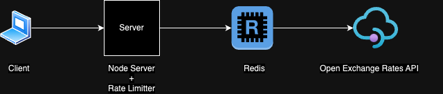
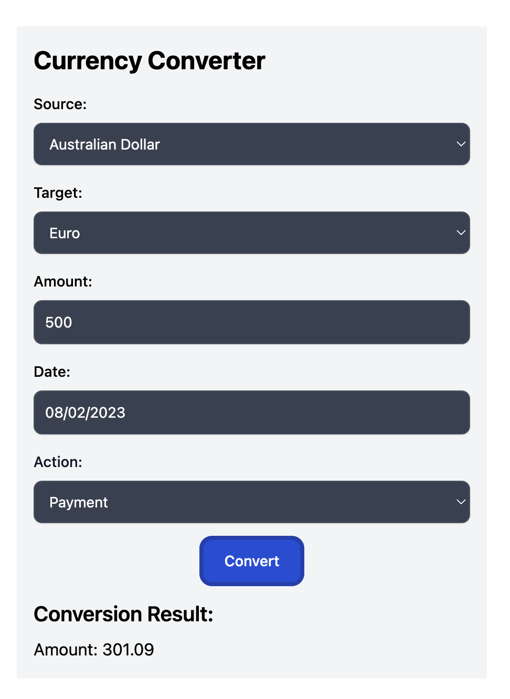
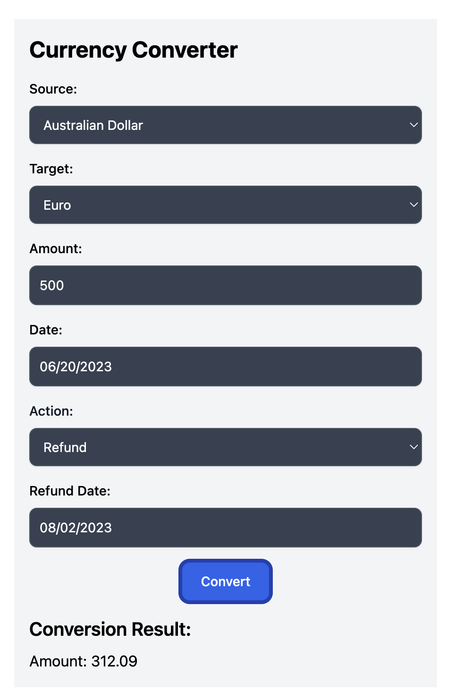

# Currency Conversion API

The Currency Conversion API provides a RESTful interface for performing currency conversions based on the given data, including source currency, target currency, source currency amount, and date (exchange rate of the date). The API also supports refund scenarios.

## Table of Contents

- [Introduction](#introduction)
- [Assignment Context](#user-stories)
  - [User stories](#user-stories)
  - [Functional Signature](#functional-signature)
- [Architecture](#architecture)
  - [REST API Endpoint Decision](#rest-api-endpoint-decision)
  - [Grouping User Stories](#grouping-user-stories)
  - [Refund Approach](#refund-approach)
- [Backend](#backend)
  - [Explanation](#explanation)
  - [Implementation Details](#implementation-details)
  - [Setup Guide](#backend-setup-guide)
  - [Endpoints/API Reference](#endpointsapi-reference)
  - [Request Examples](#request-examples)
- [Frontend](#frontend)
- [How to Make this Production Level Solution](#how-to-make-this-production-level-solution)
  - [Pricing calculations in real time](#pricing-calculations-in-real-time)
  - [Overall API](#overall-api)

## Introduction

This project involves implementing a REST API to perform currency conversions based on the given data, which includes source currency, target currency, source currency amount, and date (exchange rate of the date). The API will handle three user stories related to currency conversion and refund scenarios. The API will make use of a third-party API to fetch exchange rates for a given date, and we will implement a caching layer to minimize the number of API
calls and optimize performance.

## Assignment context

### User Stories

- As a customer, I want to pay for a car that costs 350 AUD in USD today.
- As a customer, I want to pay for a car that costs 350 AUD in EUR today.
- As a customer, I want to pay for a car that costs 350 AUD in AUD today.
- As Karmo, I want to refund 500 AUD in USD on April 15, 2022.

### Functional Signature

The currency conversion function will be defined as follows:

`convert(date, amountInSourceCurrency, sourceCurrency, targetCurrency) -> amountInTargetCurrency`

## Architecture

We have chosen to implement a REST API for currency conversion due to its simplicity and standardization. To ensure data privacy and security, we will use the POST method for sensitive data transmission.

### REST API Endpoint Decision

Considering the need to submit sensitive data (source currency, source currency amount, etc.) to the server, we will use the POST request to hide this information in the request body. Additionally, the exchange rates are updated daily, and the third-party API comes with a limited number of requests (free tier). To minimize API calls, we will implement a caching layer outside the Node server to preserve cached data even if the server crashes. and Api Rate limiter using Redis

### Grouping User Stories

We can group the given user stories into two groups:

Group 1: Payment

- User stories 1, 2, and 3 fall into the payment category, where customers want to pay for a car in different currencies today.

Group 2: Refund

- User story 4 falls into the refund category. Here, we are given the date when the original transaction was made, and the customer wants to refund today.

### Refund Approach

For refund scenarios, we have two different approaches:

Group 1 - Most Common Approach:

- Full Refund in Unit Currency (USD), doing the transaction in USD with the same purchasing power in USD.

Group 2:

- Full Refund in Local Currency (Original Rate), refunding the equivalent amount in the user's local currency based on the exchange rate at the time of the original transaction.

Based on the above considerations, we will proceed with the first approach for handling refund scenarios.

We will continue with the development and implementation, optimizing the API to provide efficient and accurate currency conversions and refunds.

## Backend



### Explanation:

- The client sends requests to your Node Server (Your API) to perform currency conversion or initiate a refund.
- The Node Server first checks the Redis Cache to see if the required exchange rate data is available.
- If the data is found in the Redis Cache, the Node Server retrieves it directly from there, avoiding the need to make a request to the Third-Party API.
- If the data is not present in the cache, the Node Server fetches the exchange rates from the Third-Party API, stores them in the Redis Cache for future use, and then provides the data to the client.
- The Redis Cache acts as an intermediate caching layer, optimizing performance by reducing redundant calls to the Third-Party API and speeding up subsequent requests for the same data.

With this architecture, the Redis Cache serves as a fast and efficient buffer, reducing response times and load on the external Third-Party API, thereby enhancing the overall efficiency and responsiveness of your currency converter API.

### Implementation Details:

- The Node Server will be implemented using Node.js and Express.js to handle client requests and interact with Redis and the third-party API.

- The Redis Cache will be implemented using the "redis" Node.js library to store and retrieve exchange rate data.
- The fetch will be used to make HTTP requests to the third-party API and fetch historical exchange rates for a given date.
- The Node Server will include error handling and rate limiting mechanisms to handle possible issues with the third-party API and prevent excessive API calls.
- Cover with test cases both integration and unit
- Input data validation using Zod

### Setup Guide

1. Clone the repository:

```bash
git clone git@github.com:vishvagayanlk/currency-converter-api.git
cd currency-converter-api
```

2. Run docker compose file to up and run redis

```bash
docker-compose up -d
```

3. Access the API:

```
npm run start
```

Your Currency Conversion API should now be accessible at http://localhost:3000.

### Endpoints/API Reference

The API provides the following endpoints:

POST /api/convert: Perform currency conversion

### Request Examples

To perform a currency conversion, send a POST request to /api/convert with the following request body:

1. Payment

```
{
  "amount": 200,
  "sourceCurrency": "AUD",
  "targetCurrency": "GBP",
  "date": "2023-07-30",
  "action": "PAYMENT",
}
```

2. Refund

```
{
  "amount": 200,
  "sourceCurrency": "AUD",
  "targetCurrency": "GBP",
  "date": "2023-07-30",
  "action": "REFUND",
  "refundDate": "2023-07-30T18:30:00.000Z"
}
```

### Frontend

we use React We build Form to interact with api using React-Formik with react query to cache same kindof input useMutation here act as a useQuery we cache it with input values
so there is no unnecessary fetching form end point (client side caching)

<div style="display: flex;">
  <div style="flex: 1; margin-right: 10px;">
    <div>Payment</div>
    
  </div>
  <div style="flex: 1;">
    <div>Refund</div>
    
  </div>
</div>

## How make this Production Level solution

### Pricing calculations in real time

Implement request collapsing techniques

- When server in peak time: Request collapsing which are came in same time (exact moment)
- When server in not peak time: Request collapsing which are came in short duration like 30 seconds
- client side caching
- use third-party who are giving data streaming api
- Rate limiter

### Overall API

- implement load balancer
- Multi-region Deployment : based on audience locations
- create CI
- create authentication layer
